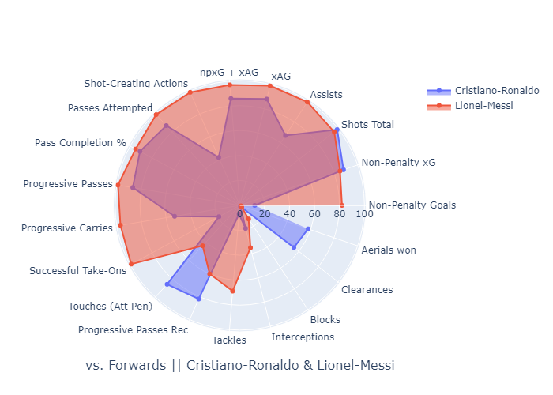

This python project allows you to get charts for a players performance in the last 365 days. The data is fetched from [fbref](Fbref.com) using beautifulsoup. 

For multi player search, if the players share a position. their stats are plotted in the same chart

<!-- 
*Messi and Ronaldo share the forward postion* -->

Any positions that aren't shared are plotted in a seperate chart
<!--  -->

